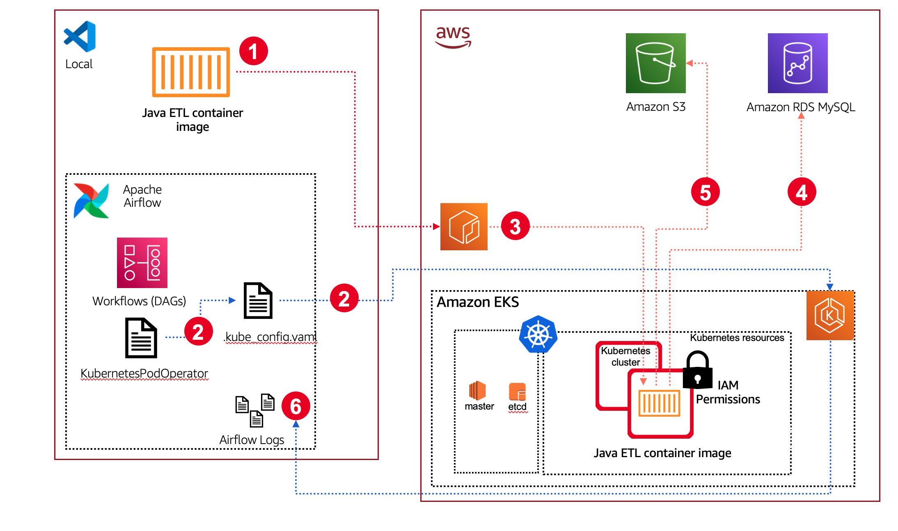
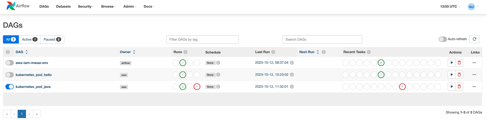

## How to use this repo

This repo provides code that was used during the demo of the talk at All Things Open 2023. It is provided to share the code so you can review, use, and do whatever you would like. I hope it will help make it easier to understand.

**Overview**

The demo showcases how you can use the KubernetesPodOperator to run tasks that are orchestrated by Apache Airflow, on a Kubernetes cluster. In this demo, I have setup a MySQL database which we want to export data into an Amazon S3 bucket (which we have created). We want to do this in Java, so the demo will take some Java code that does this, and we will then containerise this so we can then run this in our Kubernetes environment. As we do not want to do this ourselves, we will then create a workflow in Apache Airflow, that we will use to run/orchestrate the running of that Java code.



In order to get this demo working, you will need to do a few things:

* create our container that we want to run
* create our Kubernetes cluster
* create our Apache Airflow workflow

I will cover this in enough detail to get you going, and have tried to automate stuff as much as possible to make it easier.

You will need to have access to a few things to get this working:

* access to a local machine (Mac or Linux will work, Windows may work although not tested) where you have Docker, docker-compose, git installed
* access to AWS and AWS tools such as AWS CDK, AWS CLI with Admin access

## Creating our Container image

**Building the Java on Airflow Container**

You can build the container by running the following command from the java-on-airflow directory

```
docker build -t java-on-airflow .
```
Which should generate output similar to the following

```
[+] Building 38.8s (11/11) FINISHED                                                                                                                                             docker:desktop-linux
 => [internal] load .dockerignore                                                                                                                                                               0.0s
 => => transferring context: 2B                                                                                                                                                                 0.0s
 => [internal] load build definition from Dockerfile                                                                                                                                            0.0s
 => => transferring dockerfile: 302B                                                                                                                                                            0.0s
 => [internal] load metadata for docker.io/library/amazoncorretto:17                                                                                                                            1.1s
 => [internal] load build context                                                                                                                                                               0.0s
 => => transferring context: 972B                                                                                                                                                               0.0s
 => CACHED [builder 1/5] FROM docker.io/library/amazoncorretto:17@sha256:eaa4ff4026b888b602b9cef6875a7b763ab4b3076f1257c14237bd31bea54167                                                       0.0s
 => [builder 2/5] COPY . /app                                                                                                                                                                   0.0s
 => [builder 3/5] COPY app /app                                                                                                                                                                 0.0s
 => [builder 4/5] WORKDIR /app                                                                                                                                                                  0.0s
 => [builder 5/5] RUN ./mvnw package                                                                                                                                                           37.3s
 => [stage-1 2/2] COPY --from=builder /app/target/airflow-java-1.0-SNAPSHOT.jar /app/                                                                                                           0.1s 
 => exporting to image                                                                                                                                                                          0.1s 
 => => exporting layers                                                                                                                                                                         0.1s 
 => => writing image sha256:e46474122a4abeae9d0b43d21add1aaa75aaddf595f074d4a30c20925df2394e                                                                                                    0.0s 
 => => naming to docker.io/library/java-on-airflow                                                                                                                                                  0.0s 
                                                     
```

You can now run the Java script using the following command

```
docker run  java-on-airflow
```
Which should ouput the following:
```
Usage: java DatabaseToS3Exporter <db-server> <db-name> <sql-query> <s3-bucket-name> <aws-region> <secret-arn>
```

**Uploading to the container image repository**

I have provided a simple script that automates the building and pushing of this container image to a container image repository running on Amazon ECR. To run, first edit the setup.sh file in the java-on-airflow directory (you will need to update your AWS account details, AWS region, etc - its pretty simple) and then you can simply use the following command from the command line to run everything

```
./setup.sh
```

you should get something similar to this

```
Login Succeeded

An error occurred (RepositoryNotFoundException) when calling the DescribeRepositories operation: The repository with name 'ato-airflow' does not exist in the registry with id '704533066374'
Creating repos as it does not exists
[+] Building 32.0s (12/12) FINISHED                                                                                                                                             docker:desktop-linux
 => [internal] load .dockerignore                                                                                                                                                               0.0s
 => => transferring context: 2B                                                                                                                                                                 0.0s
 => [internal] load build definition from Dockerfile                                                                                                                                            0.0s
 => => transferring dockerfile: 290B                                                                                                                                                            0.0s
 => [internal] load metadata for docker.io/library/amazoncorretto:17                                                                                                                            0.9s
 => [auth] library/amazoncorretto:pull token for registry-1.docker.io                                                                                                                           0.0s
 => [internal] load build context                                                                                                                                                               0.0s
 => => transferring context: 960B                                                                                                                                                               0.0s
 => CACHED [builder 1/5] FROM docker.io/library/amazoncorretto:17@sha256:eaa4ff4026b888b602b9cef6875a7b763ab4b3076f1257c14237bd31bea54167                                                       0.0s
 => [builder 2/5] COPY . /app                                                                                                                                                                   0.0s
 => [builder 3/5] COPY app /app                                                                                                                                                                 0.0s
 => [builder 4/5] WORKDIR /app                                                                                                                                                                  0.0s
 => [builder 5/5] RUN ./mvnw package                                                                                                                                                           30.7s
 => [stage-1 2/2] COPY --from=builder /app/target/airflow-java-1.0-SNAPSHOT.jar /app/                                                                                                           0.0s 
 => exporting to image                                                                                                                                                                          0.1s 
 => => exporting layers                                                                                                                                                                         0.1s 
 => => writing image sha256:97a3535a34a765d8986e371b61edb26aeb8ba9858281de4648946531562375d2                                                                                                    0.0s 
 => => naming to xxxx.dkr.ecr.eu-west-1.amazonaws.com/ato-airflow:latest                                                                                                                0.0s 
                                                                                                                                                                                                     
What's Next?
  View a summary of image vulnerabilities and recommendations → docker scout quickview
The push refers to repository [704533066374.dkr.ecr.eu-west-1.amazonaws.com/ato-airflow]
82fba2b5455b: Pushed 
e10e452b681d: Pushed 
4f9883c58bf0: Pushed 
airflw-amd64: digest: sha256:29ab4687c9f3e881d08bfeea57f115fe21668e531ecd1c64b5967b629ed865a2 size: 954
Created manifest list xxxx.dkr.ecr.eu-west-1.amazonaws.com/ato-airflow:airflw
{
   "schemaVersion": 2,
   "mediaType": "application/vnd.docker.distribution.manifest.list.v2+json",
   "manifests": [
      {
         "mediaType": "application/vnd.docker.distribution.manifest.v2+json",
         "size": 954,
         "digest": "sha256:29ab4687c9f3e881d08bfeea57f115fe21668e531ecd1c64b5967b629ed865a2",
         "platform": {
            "architecture": "amd64",
            "os": "linux"
         }
      }
   ]
}
sha256:0ed51cc743aff6491265ef190fff46423b4c7fddb53e9ddc310d555ed49ca296
```

> **Local Setup**
> 
> You can run/test locally, although the script does use AWS to 1/grab secrets information to connect to the MySQL database, 2/upload the query in csv format. You could change the Java code to do this differently if you wanted. To run this against a local MySQL instance, I used the following to first start a local MySQL test instance.
>
> ```
> docker run --name mysql -d \
>    -p 3306:3306 \
>    -e MYSQL_ROOT_PASSWORD=change-me \
>    --restart unless-stopped \
>    mysql:8
>```

**Database credentials**

We need to make sure that our container workloads can access the resources they need. Kubernetes does allow you to manage secrets, but as we have created the code in Java, we will store our secret an a secrets store. I will be using AWS Secrets Manager in the code, which means we now have to define that secret. 

We create a new secret to store the username/password in the AWS Secrets Manager using the following command 

```
aws secretsmanager create-secret --name ato-airflow-mysql-credentials --description "Access to MySQL db" --secret-string "{\"user\":\"root\",\"password\":\"change-me\"}" --region={your region}" 
```
Which should output something similar to the following:

```
{
    "ARN": "arn:aws:secretsmanager:eu-west-1:xxxxx:secret:ato-airflow-mysql-credentials-4J8Pj8",
    "Name": "ato-airflow-mysql-credentialsxx",
    "VersionId": "9f535d71-b01b-437a-8660-cfd5437b603a"
}
```

We need the ARN later, so keep a note of it.

## Creating our Kubernetes Cluster

To make the creation our Kubernetes cluster this simpler, I am going to be using AWS CDK to provision this via some Python code.  This will create our Kubernetes cluster into which we will deploy our containerised Java code we want to schedule and orchestrate with Apache Airflow. I will be using Amazon EKS as my Kubernetes provider.

You will need to install AWS CDK - I was using version 2.100.0 (build e1b5c77) when writing this. You will also need to install additional CDK modules, specifically to match with the version of EKS we are going to be using. To do this, I simply 

```
pip install aws-cdk.lambda-layer-kubectl-v26
```
> **Note!** If you use an older version of CDK (for example, I originally started with version 2.91.0 (build eea12ea), then you might get errors with unknown or supported values - in my case, V26 of EKS.

First we provision the networking infrastructure that our Kubernetes cluster will sit in. You will first need to update your AWS account details in the app.py file, and once updated and saved, you can begin deploying the cluster.

```
cdk deploy airflow-ato-vpc

✨  Synthesis time: 13.41s

airflow-ato-vpc:  start: Building 1828cfddcf806d44c2c540d30408950f5a782b2d80668ecd6aa56352c5d489c8:704533066374-eu-west-1
airflow-ato-vpc:  success: Built 1828cfddcf806d44c2c540d30408950f5a782b2d80668ecd6aa56352c5d489c8:704533066374-eu-west-1
airflow-ato-vpc:  start: Publishing 1828cfddcf806d44c2c540d30408950f5a782b2d80668ecd6aa56352c5d489c8:704533066374-eu-west-1
airflow-ato-vpc:  success: Published 1828cfddcf806d44c2c540d30408950f5a782b2d80668ecd6aa56352c5d489c8:704533066374-eu-west-1
airflow-ato-vpc: deploying... [1/1]
airflow-ato-vpc: creating CloudFormation changeset...

 ✅  airflow-ato-vpc

✨  Deployment time: 178.73s

Outputs:
airflow-ato-vpc.ExportsOutputRefEKSApacheAirflowVPC7186324866D48E38 = vpc-01b3ae004c5b0ec73
airflow-ato-vpc.ExportsOutputRefEKSApacheAirflowVPCprivateSubnet1Subnet95721A0D36F46C32 = subnet-0af400986e4ee20f1
airflow-ato-vpc.ExportsOutputRefEKSApacheAirflowVPCprivateSubnet2Subnet505F0EBCB9A0F6CE = subnet-0520e8a2a0d081f55
airflow-ato-vpc.VPCId = vpc-01b3ae004c5b0ec73
Stack ARN:
arn:aws:cloudformation:eu-west-1:704533066374:stack/airflow-ato-vpc/fc7acdd0-6846-11ee-b4f4-0264e68345d7

✨  Total time: 192.14s
```

and then we deploy our Kubernetes cluster.

```
cdk deploy airflow-ato-eks
Including dependency stacks: airflow-ato-vpc
[Warning at /airflow-ato-eks/Airflow-EKS] You created a cluster with Kubernetes Version 1.24 without specifying the kubectlLayer property. This may cause failures as the kubectl version provided with aws-cdk-lib is 1.20, which is only guaranteed to be compatible with Kubernetes versions 1.19-1.21. Please provide a kubectlLayer from @aws-cdk/lambda-layer-kubectl-v24.

✨  Synthesis time: 12.2s

airflow-ato-vpc
airflow-ato-eks:  start: Building 25f7dc8c7a6d65604d70050f2d9d19d6bfc5060a3d74662fc86589f4385e3a1b:704533066374-eu-west-1
airflow-ato-eks:  success: Built 25f7dc8c7a6d65604d70050f2d9d19d6bfc5060a3d74662fc86589f4385e3a1b:704533066374-eu-west-1
airflow-ato-eks:  start: Building f9541c96911e18165f08a674baf5be5005375270b01f83ffa297d20129539466:704533066374-eu-west-1
```
You will be asked to confirm the security changes being made. Review and if you are happy, proceed. This will then begin the installation process

```
Do you wish to deploy these changes (y/n)? y
airflow-ato-eks: deploying... [2/2]
airflow-ato-eks: creating CloudFormation changeset...
[█████████████████████████████████▏························] (12/21)

4:14:21 PM | CREATE_IN_PROGRESS   | AWS::CloudFormation::Stack            | airflow-ato-eks
4:16:53 PM | CREATE_IN_PROGRESS   | Custom::AWSCDK-EKS-Cluster            | Airflow-EKS/Resource/Resource/Default
```
It will take around 20-25 minutes to complete, so time to relax with your favourite beverage! When finished, you should see something like

```
 ✅  airflow-ato-eks

✨  Deployment time: 992.93s

Outputs:
airflow-ato-eks.AirflowEKSConfigCommand46D53F40 = aws eks update-kubeconfig --name AirflowEKS9392A036-0a5568c2c38244bb9f7036ceaeba24ae --region eu-west-1 --role-arn arn:aws:iam::xxxx:role/airflow-ato-eks-ClusterAdminRole047D4FCA-JQ5FP70JIE7Q
airflow-ato-eks.AirflowEKSGetTokenCommand680E1252 = aws eks get-token --cluster-name AirflowEKS9392A036-0a5568c2c38244bb9f7036ceaeba24ae --region eu-west-1 --role-arn arn:aws:iam::xxxx:role/airflow-ato-eks-ClusterAdminRole047D4FCA-JQ5FP70JIE7Q
airflow-ato-eks.EKSClusterKubectlRoleARN = arn:aws:iam::xxxx:role/airflow-ato-eks-AirflowEKSCreationRole11138011-D7KR2BS2YC2L
airflow-ato-eks.EKSClusterName = AirflowEKS9392A036-0a5568c2c38244bb9f7036ceaeba24ae
airflow-ato-eks.EKSClusterOIDCProviderARN = arn:aws:iam::xxxx:oidc-provider/oidc.eks.eu-west-1.amazonaws.com/id/AD6BB392C93337B9D26787999DE39FB6
airflow-ato-eks.EKSSGID = sg-0b527c417456ea683
Stack ARN:
arn:aws:cloudformation:eu-west-1:xxxx:stack/airflow-ato-eks/03402ea0-6859-11ee-9b0f-06218bc32c01

✨  Total time: 1004.73s
```

You will notice that as part of the output (the first line) we have the command already printed out that we can copy/paste to configure kubectl to access this new EKS cluster.

```
aws eks update-kubeconfig --name AirflowEKS9392A036-0a5568c2c38244bb9f7036ceaeba24ae --region eu-west-1 --role-arn arn:aws:iam::xxxxx:role/airflow-ato-eks-ClusterAdminRole047D4FCA-JQ5FP70JIE7Q
Added new context arn:aws:eks:eu-west-1:xxxxx:cluster/AirflowEKS9392A036-0a5568c2c38244bb9f7036ceaeba24ae to /Users/ricsue/.kube/config
```

You can verify that it all works by running the following command:

```
kubectl get pods -A
NAMESPACE     NAME                       READY   STATUS    RESTARTS        AGE
kube-system   aws-node-4czpb             1/1     Running   1 (9m18s ago)   11m
kube-system   aws-node-nrnpk             1/1     Running   1 (9m18s ago)   11m
kube-system   coredns-8497958466-c2ptz   1/1     Running   1 (9m18s ago)   16m
kube-system   coredns-8497958466-f6lr8   1/1     Running   1 (9m18s ago)   16m
kube-system   kube-proxy-4ljvl           1/1     Running   1 (9m18s ago)   11m
kube-system   kube-proxy-fwg47           1/1     Running   1 (9m18s ago)   11m
```

We will now create a Kubernetes name space (called ato-airflow) where we will deploy our Airflow orchestrated containers.

```
kubectl create namespace ato-airflow
namespace/ato-airflow created

kubectl get ns -A
NAME              STATUS   AGE
ato-airflow       Active   59s
default           Active   25m
kube-node-lease   Active   25m
kube-public       Active   25m
kube-system       Active   25m
```

We are now going to create a new Role for this namespace, which will provide it with the needed permissions to access resources. In this instance, we need it to access Amazon S3 to upload a file, and Amazon RDS, to access our MySQL database.

```
cat << EOF | kubectl apply -f - -n ato-airflow
kind: Role
apiVersion: rbac.authorization.k8s.io/v1
metadata:
  name: ato-airflow-role
rules:
  - apiGroups:
      - ""
      - "apps"
      - "batch"
      - "extensions"
    resources:      
      - "jobs"
      - "pods"
      - "pods/attach"
      - "pods/exec"
      - "pods/log"
      - "pods/portforward"
      - "secrets"
      - "services"
    verbs:
      - "create"
      - "delete"
      - "describe"
      - "get"
      - "list"
      - "patch"
      - "update"
---
kind: RoleBinding
apiVersion: rbac.authorization.k8s.io/v1
metadata:
  name: ato-airflow-role-binding
subjects:
- kind: User
  name: ato-airflow
roleRef:
  kind: Role
  name: ato-airflow-role
  apiGroup: rbac.authorization.k8s.io
EOF
```

which will generate the following if successful

```
role.rbac.authorization.k8s.io/ato-airflow-role created
rolebinding.rbac.authorization.k8s.io/ato-airflow-role-binding created
```
Now lets create a suitable AWS IAM permissions policy - for this demo we are providing broad access, but you should NEVER do this when you do this for real in production. 

```
cat >ato-eks-policy.json <<EOF
{
    "Version": "2012-10-17",
    "Statement": [
        {
            "Effect": "Allow",
            "Action": "s3:GetObject",
            "Resource": "arn:aws:s3:::all-things-open-2023"
        },
        {
            "Effect": "Allow",
            "Action": "rds:*",
            "Resource": "*"
        }
    ]
}
EOF
```

We will now create an AWS IAM policy and Role, which we will assign to our Kubernetes Pod and will provide it with the permissions of what it is allowed to do.

```
aws iam create-policy --policy-name ato-eks-policy --policy-document file://ato-eks-policy.json

aws iam create-role \
  --role-name ato-airflow-k8s-iam-role \
  --assume-role-policy-document file://ato-trust-policy.json
  
aws iam attach-role-policy --policy-arn arn:aws:iam::704533066374:policy/ato-eks-policy --role-name ato-airflow-k8s-iam-role

```

We now have our service account (called ato-airflow) which we will use to create a configuration file which we will need to keep with our Airflow workflow, and will be used to handle the connectivity and authentication. As such, it is pretty important (ok critical) that this file is well secured - do not publish this in your git repository or make widely available.

```
eksctl create iamidentitymapping \
--region eu-west-1 \
--cluster AirflowEKS9392A036-0a5568c2c38244bb9f7036ceaeba24ae \
--arn arn:aws:iam::704533066374:role/ato-airflow-k8s-iam-role \
--username ato-airflow
```

Which should generate output such as 

```
2023-10-12 10:27:50 [ℹ]  checking arn arn:aws:iam::704533066374:role/ato-airflow-k8s-iam-role against entries in the auth ConfigMap
2023-10-12 10:27:50 [ℹ]  adding identity "arn:aws:iam::704533066374:role/ato-airflow-k8s-iam-role" to auth ConfigMap
```

> **Note!** If you get an error such as "Error: getting list of API resources for raw REST client: Unauthorized" then it is most likely that the AWS identity you are using is not in the Kubernetes config map (the config map is where Kubernetes know who can access and what level of access they have). 

##Starting Apache Airflow locally

For this demo I am going to use mwaa-local-runner, an open source project that makes it super easy to get up and running with Apache Airflow and one of my favourite projects. You will need to have a Docker engine available, as well as docker-compose.

I have already added everything you need in the repo, but there are a few things you are going to need to change.

* you will need to update your local credentials - update the ".env.localrunner" file in the "docker/config" directory
* you will need to adjust the paths in the Docker file - update the docker-compose-local.yml file, and adjust the volumes that are mount to reflect your local setup
* you will need to build an image once you have updated everything, which will download and build the necessary mwaa-local-runner and apache airflow files - to do this, run "mwaa-local-env build-image" and then wait around 10-15 minutes while the build process completes. Upon completion, you will now have a bunch of container images locally grouped under mwaa-local-runner

> **NOTE!** If you have any containers or processes running that are listening/holding port 8080/5555/5432 and 8793, then it is likely this will fail as these ports are needed by the local Apache Airflow and supporting services.

Once you have completed the above, to start Apache Airflow locally, simply run "mwaa-local-env start" which will bring up Apache Airflow. Opening a browser on localhost:8080, you will see the familiar Apache Airflow UI. You can log in with the default test account (admin/test). There should be a single DAG already there, called "aws-iam-mwaa-env" which you can enable and run. If successful, this should print out the AWS credentials in which your local Apache Airflow is running (which was configured above when you set up the local credentials)

If this all worked we are good to go for the next step.

**Airflow Operators**

Before we can start to interact with Kubernetes, we need to make sure that we have installed the necessary Airflow Operators. Airflow manages the different integrations to systems via provider packages, which you can install as Python libraries. These are installed by updating the Airflow requirements.txt file.

> **NOTE!** Airflow Operators are NOT the same as Kubernetes Operators - it is worth mentioning this so you do not get confused.

We have already done this for you, so there is no need to do anything. However, it is worth mentioning because as you begin your own experimentations, you will need to first ask yourself do I have all the Airlfow operators installed - by default, they are not all deployed as there are so many! In the code, we can see the Airflow operators we are going to be using are:

```
--constraint "https://raw.githubusercontent.com/apache/airflow/constraints-2.4.3/constraints-3.10.txt"


apache-airflow-providers-mysql==3.2.1
kubernetes==23.6.0
apache-airflow-providers-cncf-kubernetes==4.4.0
```

**Configuring your kube_config**

In order for our workflows/DAGs to interact with Kubernetes, we need to provide a configuration file that tells our workflow everything it needs to know about how to connect to the Kubernetes cluster. This is done via the kube_config file, which will probably be familiar with if you are used to Kubernetes. We need to generate one for the Kubernetes Pods in which we want to run our containers.

> **WARNING!** Do not store the kube_config file in any public or shared repositories. It contains sensitive information, such as certificates, which will allow anyone with that file to gain access to your Kubernetes environment.

We create this file using the AWS cli, 

```
aws eks update-kubeconfig \
--region eu-west-1 \
--kubeconfig ./kube_config.yaml \
--name AirflowEKS9392A036-0a5568c2c38244bb9f7036ceaeba24ae \
--alias aws
```
Which should produce the following output, and generate a file in the directory where you ran the command:

```
Added new context aws to /Users/ricsue/Projects/AllThingsOpen/cdk-airflow-eks/kube_config.yaml
```

We will need to copy this file into the DAGs folder.

**Database connection**

We have configured our Kubernetes cluster in Amazon EKS, and so we will not be able access our local MySQL instance that we used for testing/developing our Java code. You will need to configure a MySQL database that is available for access.

I setup an Amazon RDS MySQL database for the demo, and have provided a CDK app to help simplify the setup for you. You can begin the deployment by using the following command.

```
cdk deploy airflow-ato-rds

Including dependency stacks: airflow-ato-vpc

✨  Synthesis time: 7.79s

airflow-ato-vpc
airflow-ato-rds:  start: Building 6e101471f57b918811bc7baff6bc628a0f72052d5ebd8e7f232f91f256a156f1:xxxx-eu-west-1
airflow-ato-rds:  success: Built 6e101471f57b918811bc7baff6bc628a0f72052d5ebd8e7f232f91f256a156f1:xxxxx-eu-west-1
airflow-ato-vpc: deploying... [1/2]
airflow-ato-vpc: creating CloudFormation changeset...

 ✅  airflow-ato-vpc (no changes)

✨  Deployment time: 1.7s

Outputs:
airflow-ato-vpc.ExportsOutputRefEKSApacheAirflowVPC7186324866D48E38 = vpc-01b3ae004c5b0ec73
airflow-ato-vpc.ExportsOutputRefEKSApacheAirflowVPCprivateSubnet1Subnet95721A0D36F46C32 = subnet-0af400986e4ee20f1
airflow-ato-vpc.ExportsOutputRefEKSApacheAirflowVPCprivateSubnet2Subnet505F0EBCB9A0F6CE = subnet-0520e8a2a0d081f55
airflow-ato-vpc.VPCId = vpc-01b3ae004c5b0ec73
Stack ARN:
arn:aws:cloudformation:eu-west-1:xxxx:stack/airflow-ato-vpc/fc7acdd0-6846-11ee-b4f4-0264e68345d7

✨  Total time: 9.49s

airflow-ato-rds:  start: Publishing 6e101471f57b918811bc7baff6bc628a0f72052d5ebd8e7f232f91f256a156f1:704533066374-eu-west-1
airflow-ato-rds:  success: Published 6e101471f57b918811bc7baff6bc628a0f72052d5ebd8e7f232f91f256a156f1:704533066374-eu-west-1
airflow-ato-rds
This deployment will make potentially sensitive changes according to your current security approval level (--require-approval broadening).
Please confirm you intend to make the following modifications:
```

It will ask you to review the security changes. After you have reviewed, if you are happy to proceed respond YES. It will take around 10-15 mins to complete

```
 ✅  airflow-ato-rds

✨  Deployment time: 541.88s

Outputs:
airflow-ato-rds.RDSDNSEndpoint = airflow-ato-rds-mysqlinstance2cfb48f1-fbvkw26bj0xk.ceinb9vexcbc.eu-west-1.rds.amazonaws.com
airflow-ato-rds.RDSSecret = airflow-ato-rds/MySqlInstance/Secret/Attachment
Stack ARN:
arn:aws:cloudformation:eu-west-1:xxxxx:stack/airflow-ato-rds/8d387690-68f8-11ee-aa4d-021a9c872d0d

✨  Total time: 549.66s
```

You will notice that the DNS endpoint for your MySQL database is printed out (in my example above, it is "airflow-ato-rds-mysqlinstance2cfb48f1-fbvkw26bj0xk.ceinb9vexcbc.eu-west-1.rds.amazonaws.com".

It will create an admin user and password for you. You will need to go to AWS Secrets Manager to find the password. Again, this is output by the CDK, and you can see the name of the secret (in the above example, this is "airflow-ato-rds/MySqlInstance/Secret/Attachment"

You can now log into your MySQL database and create a sample database and tables which we will use when we run our Java container.

**Creating our Airflow workflows**

We are now ready for the last stage, creating our workflow to run our containerised workload. We have now:

* setup our target MySQL database with sample data
* have an Amazon S3 bucket we are going to upload our exported data to
* we have created supporting assets such as Secrets Management
* we have created our Java container, uploaded it to a container registry
* we have created a Kubernetes cluster
* we have a local Apache Airflow environment up and running
* we have created our kube_config file that we will need to access our Kubernetes cluster and run workloads, and copied it into the DAGS folder

So far, we have done a lot. This last stage is probably the simplest, creating our workflow. Here is the code

```
from airflow import DAG
from datetime import datetime
from airflow.providers.cncf.kubernetes.operators.kubernetes_pod import KubernetesPodOperator

default_args = {
   'owner': 'aws',
   'depends_on_past': False,
   'start_date': datetime(2019, 2, 20),
   'provide_context': True
}

dag = DAG('kubernetes_pod_java', default_args=default_args, schedule_interval=None)

kube_config_path = '/usr/local/airflow/dags/kube_config.yaml'

podRun = KubernetesPodOperator(
                       namespace="ato-airflow", 
                       image="704533066374.dkr.ecr.eu-west-1.amazonaws.com/ato-airflow:airflw",
                       cmds=["java"],
                       arguments=["-jar", "app/airflow-java-1.0-SNAPSHOT.jar", "localhost", "customers", "select * from customers;", "all-things-open-2023", "eu-west-1","arn:aws:secretsmanager:eu-west-1:xxxx:secret:ato-airflow-mysql-credentials-2QiMNR"],
                       labels={"foo": "bar"},
                       name="mwaa-pod-java",
                       task_id="pod-task",
                       get_logs=True,
                       dag=dag,
                       is_delete_operator_pod=False,
                       config_file=kube_config_path,
                       in_cluster=False,
                       cluster_context='aws'
                       )

```

You will see that this workflow has a single task, which uses the KubernetesPodOperator. It references the kube_config file we uploaded into the DAGS folder. The task itself has a number of configuration parameters.

* namespace - this is where you want to run your container
* images - this is the container image you want to run
* cmd and arguments - this is how you want to pass commands to that container, which as you can see from the above, are the parameters that control the database server, user credentials, query to run, target S3 bucket, and more
* config_file - points to the kube_config variable that tells this workflow where to find it

I have left the other details defaults, and you can read about those in the operator documentation ([here](https://airflow.apache.org/docs/apache-airflow-providers-cncf-kubernetes/stable/operators.html))

Once we save this in our DAGS folder, it should appear as a new DAG. 



Once it has appeared, you can enable it and then trigger it. If all is well, it should go green and complete. You can also look at the logs in Airflow.

```
AIRFLOW_CTX_DAG_OWNER=aws
AIRFLOW_CTX_DAG_ID=kubernetes_pod_java
AIRFLOW_CTX_TASK_ID=pod-task
AIRFLOW_CTX_EXECUTION_DATE=2023-10-12T11:05:24.624603+00:00
AIRFLOW_CTX_TRY_NUMBER=1
AIRFLOW_CTX_DAG_RUN_ID=manual__2023-10-12T11:05:24.624603+00:00
[2023-10-12, 11:05:26 UTC] {{kubernetes_pod.py:587}} INFO - Creating pod mwaa-pod-java-95c70eceda154e0bad874ee13255ee53 with labels: {'dag_id': 'kubernetes_pod_java', 'task_id': 'pod-task', 'run_id': 'manual__2023-10-12T110524.6246030000-56a262fc8', 'kubernetes_pod_operator': 'True', 'try_number': '1'}
[2023-10-12, 11:05:26 UTC] {{logging_mixin.py:137}} WARNING - /usr/local/***/.local/lib/python3.10/site-packages/***/providers/cncf/kubernetes/hooks/kubernetes.py:166 DeprecationWarning:
Applying core Airflow settings from section [kubernetes] with the following keys:
        enable_tcp_keepalive=False
In a future release, KubernetesPodOperator will no longer consider core
Airflow settings; define an Airflow connection instead.
[2023-10-12, 11:05:27 UTC] {{kubernetes_pod.py:380}} INFO - Found matching pod mwaa-pod-java-95c70eceda154e0bad874ee13255ee53 with labels {'airflow_kpo_in_cluster': 'False', 'airflow_version': '2.4.3', 'dag_id': 'kubernetes_pod_java', 'foo': 'bar', 'kubernetes_pod_operator': 'True', 'run_id': 'manual__2023-10-12T110524.6246030000-56a262fc8', 'task_id': 'pod-task', 'try_number': '1'}
[2023-10-12, 11:05:27 UTC] {{kubernetes_pod.py:381}} INFO - `try_number` of task_instance: 1
[2023-10-12, 11:05:27 UTC] {{kubernetes_pod.py:382}} INFO - `try_number` of pod: 1
[2023-10-12, 11:05:27 UTC] {{pod_manager.py:180}} WARNING - Pod not yet started: mwaa-pod-java-95c70eceda154e0bad874ee13255ee53
[2023-10-12, 11:05:28 UTC] {{pod_manager.py:228}} INFO - SLF4J: Failed to load class "org.slf4j.impl.StaticLoggerBinder".
[2023-10-12, 11:05:28 UTC] {{pod_manager.py:228}} INFO - SLF4J: Defaulting to no-operation (NOP) logger implementation
[2023-10-12, 11:05:28 UTC] {{pod_manager.py:228}} INFO - SLF4J: See http://www.slf4j.org/codes.html#StaticLoggerBinder for further details.
[2023-10-12, 11:05:29 UTC] {{pod_manager.py:253}} WARNING - Pod mwaa-pod-java-95c70eceda154e0bad874ee13255ee53 log read interrupted but container base still running
[2023-10-12, 11:05:30 UTC] {{pod_manager.py:228}} INFO - SLF4J: Failed to load class "org.slf4j.impl.StaticLoggerBinder".
[2023-10-12, 11:05:30 UTC] {{pod_manager.py:228}} INFO - SLF4J: Defaulting to no-operation (NOP) logger implementation
[2023-10-12, 11:05:30 UTC] {{pod_manager.py:228}} INFO - SLF4J: See http://www.slf4j.org/codes.html#StaticLoggerBinder for further details.
[2023-10-12, 11:05:30 UTC] {{pod_manager.py:275}} INFO - Pod mwaa-pod-java-95c70eceda154e0bad874ee13255ee53 has phase Running
[2023-10-12, 11:05:32 UTC] {{kubernetes_pod.py:478}} INFO - skipping deleting pod: mwaa-pod-java-95c70eceda154e0bad874ee13255ee53
[2023-10-12, 11:05:32 UTC] {{taskinstance.py:1401}} INFO - Marking task as SUCCESS. dag_id=kubernetes_pod_java, task_id=pod-task, execution_date=20231012T110524, start_date=20231012T110525, end_date=20231012T110532
[2023-10-12, 11:05:33 UTC] {{local_task_job.py:159}} INFO - Task exited with return code 0
[2023-10-12, 11:05:33 UTC] {{taskinstance.py:2623}} INFO - 0 downstream tasks scheduled from follow-on schedule check
```

The output produced by the Java script was not exciting, so we see nothing of interest. However, you should see that it runs and that you now have a new file in your S3 bucket.

## Cleaning up

Make sure you remove/delete all resources once you hare happy you understand how this works. For the AWS resources, you can easily delete them by running the following commands:

```
cdk destroy airflow-ato-rds
cdk destroy airflow-ato-eks
cdk destroy airflow-ato-vpc
```
This will not remove/delete your container images, so you should go into Amazon ECR and delete the images that were created manually.
